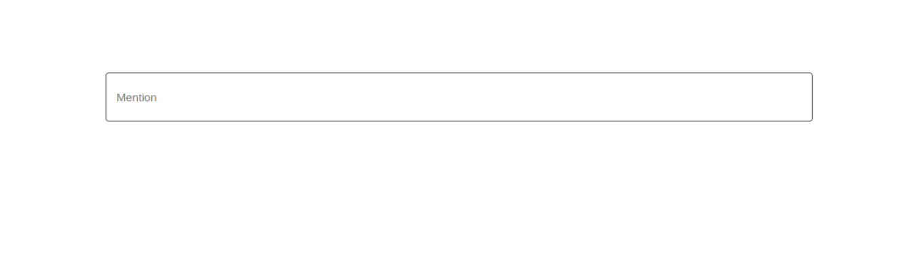
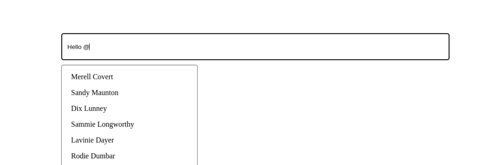
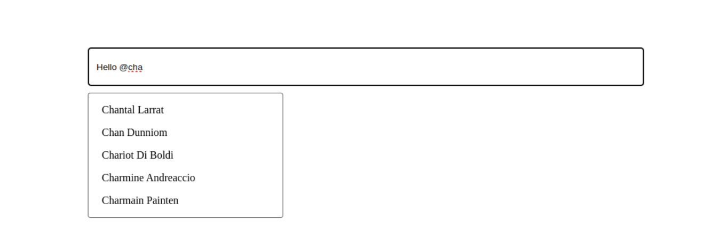

# Squadcast assignement

Project: Mentions component <br/>
Link to design: [Design](https://www.figma.com/file/EEmRktq44VPR3u8Lx7otOJ/Frontend-Assignment---Dropdown?type=design&t=YyUdu9qHBb3sS66T-6)

Description: 
This is similar to the @-mentions in X/Twitter. The user can type any text in the input element but when user types `@` then a select box should appear from which they can select an option and it should be displayed in input element. For example `Hi @Luke Skywalker may the force be with you.`. 

## installation and setup - 
open the terminal and follow the below steps
1.  clone the repo
     ```
       git clone https://github.com/soumitha18/mention_name
     ```
2.  Go inside the repository
     ```
       cd mention_name
     ```
3.  Install dependencies
     ```
        npm install
     ```
4.  Start
     ```
        npm start
     ```

app will run in `http://localhost:3000/`

## page will look like 
<br/>

<br/>

### The flow will be 





## Cypress Setup and run 
[cypress](https://github.com/soumitha18/mention_name/tree/main/cypress/README.md)
