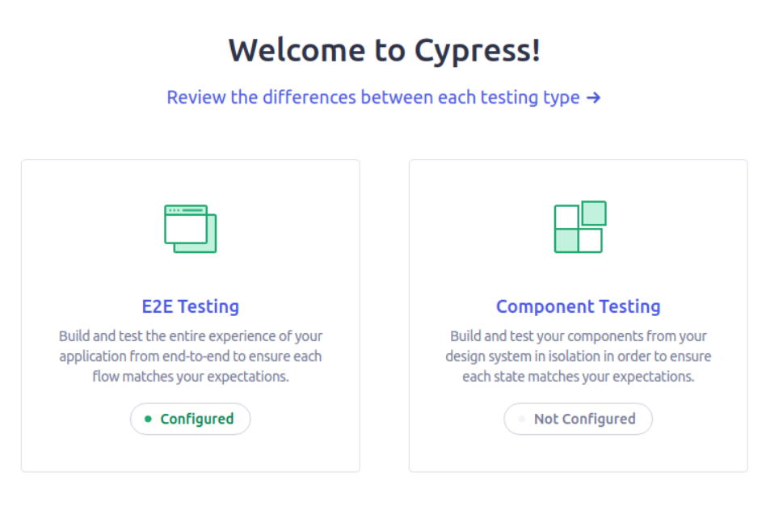
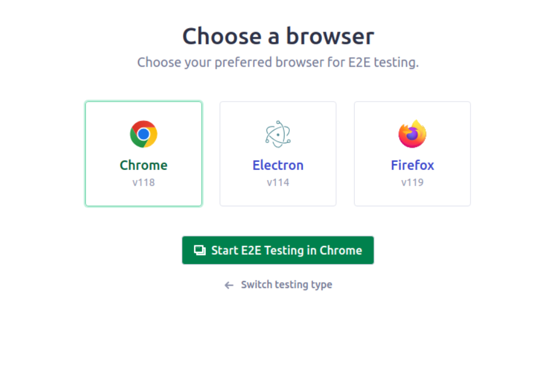
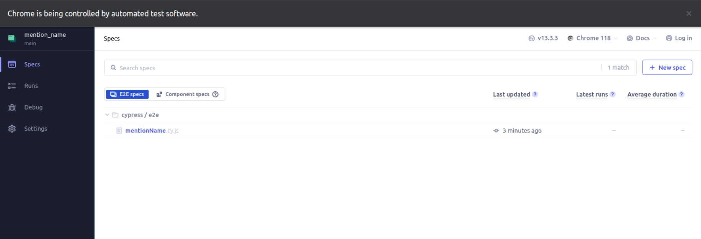
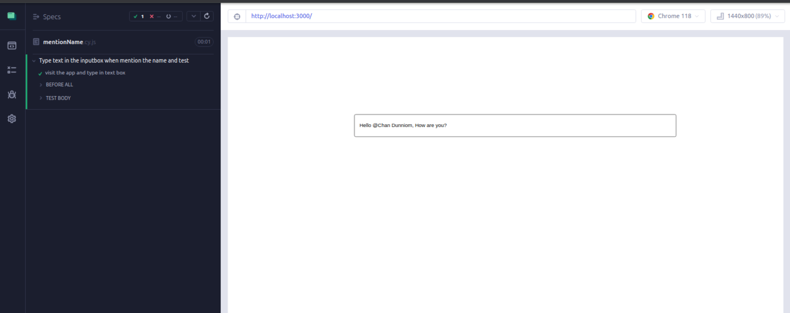

## Cypress Setup and run

1. Go to terminal and execute the below steps
     ```sh
         npx cypress open
    ```
     it will redirect to the cypress browser
     <br/>
2. click on `configured` which is under `E2E Testing`<br/>
     it will redirect to `browsers selection`
     <br/>
3. click on `Start E2E Testing in Chrome`<br/>
     You can see the set of all test cases
     <br/>
4. click on `mentionName.cy.js` - test case will get run<br/>
     <br/>
     If the test case is passed, it will look like this<br/>
